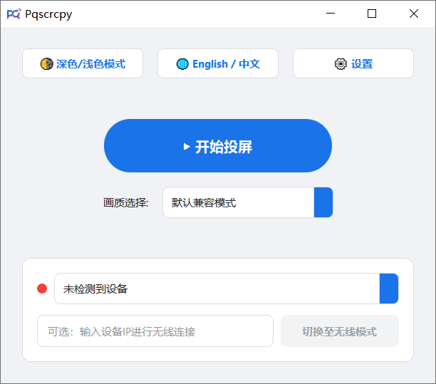
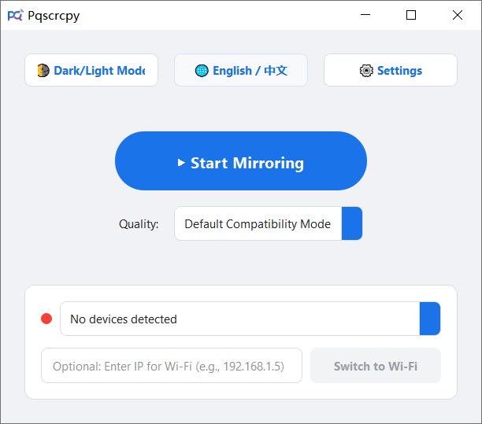

# Pqscrcpy

**简体中文 &nbsp; | &nbsp; [English](#english)**

### 项目简介

Pqscrcpy 是一个基于 PyQt5 开发的 [scrcpy](https://github.com/Genymobile/scrcpy) 图形用户界面（GUI）工具。它旨在为用户提供一个直观、简单且功能丰富的安卓设备投屏与控制体验，免去记忆和输入繁杂命令行的烦恼。

### ✨ 核心功能

* **双模式连接**: 支持 USB 有线连接与 Wi-Fi 无线连接，一键切换 TCP/IP 模式。
* **多配置管理**: 预设并支持最多 10 个自定义画质配置（支持修改分辨率、比特率、最大帧率，以及 `h264` / `h265` / `av1` 编码器切换）。
* **高级投屏控制**:
* 一键开启/关闭音频传输。
* 支持 UHID 物理键盘与手柄映射。
* 关闭设备屏幕投屏（Turn screen off）及唤醒保持常亮。
* 窗口置顶、无边框模式、全屏模式与只读模式。

* **实用悬浮组件**:
* **虚拟导航栏**: 屏幕边缘的可悬浮、可拖拽导航栏（返回、主页、最近任务）。
* **性能监测面板**: 实时显示当前画面的 FPS 与比特率。

* **老板键**: 支持自定义全局快捷键，一键隐藏/恢复投屏窗口与控制面板。
* **个性化与便携**:
* 内置中英双语切换，支持深色/浅色主题。
* 单文件便携式打包，首次运行自动释放核心依赖至 `%AppData%\Pqscrcpy`，无需安装 Python 或配置环境变量。

### 🚀 安装与使用

1. **准备工作**: 确保你的安卓设备已开启**开发者选项**，并启用**USB 调试**。
2. **下载**: 在 Releases 页面下载最新的 `Pqscrcpy_Portable.exe`。
3. **运行**: 直接双击运行。程序会自动检测已连接的设备，选择画质后点击“开始投屏”即可。

### 🙏 鸣谢

本项目是对以下优秀开源项目的 GUI 封装：

* **[scrcpy](https://github.com/Genymobile/scrcpy)** - Display and control your Android device.

---
**[简体中文](#chinese) &nbsp; | &nbsp; English**

### Overview

Pqscrcpy is a PyQt5-based graphical user interface (GUI) for [scrcpy](https://github.com/Genymobile/scrcpy). It aims to provide an intuitive, simple, and feature-rich Android screen mirroring and control experience, eliminating the need to memorize and type complex command-line arguments.

### ✨ Key Features

* **Dual Connection Modes**: Supports both USB wired and Wi-Fi wireless connections with a one-click TCP/IP switch.
* **Profile Management**: Save up to 10 customized quality profiles (adjust resolution, video bit-rate, max FPS, and toggle between `h264`, `h265`, and `av1` codecs).
* **Advanced Controls**:
* Toggle audio forwarding.
* UHID physical keyboard and gamepad simulation.
* Turn screen off while mirroring and keep the device awake.
* Always-on-top, borderless window, fullscreen, and read-only modes.

* **Floating Overlays**:
* **Virtual Navigation Bar**: A draggable floating navigation bar (Back, Home, Recent) configurable to screen edges.
* **Performance Monitor**: Real-time on-screen display of current FPS and video bit-rate.

* **Boss Key**: Customizable global shortcut to instantly hide or restore the mirroring window and UI.
* **Customization & Portability**:
* Bilingual support (English/Chinese) and Dark/Light theme toggle.
* Single portable executable. Automatically extracts core dependencies to `%AppData%\Pqscrcpy` on first run—no Python installation or environment variable configuration required.

### 🚀 Installation & Usage

1. **Prerequisites**: Ensure **Developer Options** and **USB Debugging** are enabled on your Android device.
2. **Download**: Get the latest `Pqscrcpy_Portable.exe` from the Releases page.
3. **Run**: Double-click to execute. The program will automatically detect connected devices. Select your desired quality and click "Start Mirroring".

### 🙏 Acknowledgements

This project is a GUI wrapper built upon the following outstanding open-source project:

* **[scrcpy](https://github.com/Genymobile/scrcpy)** - Display and control your Android device.
